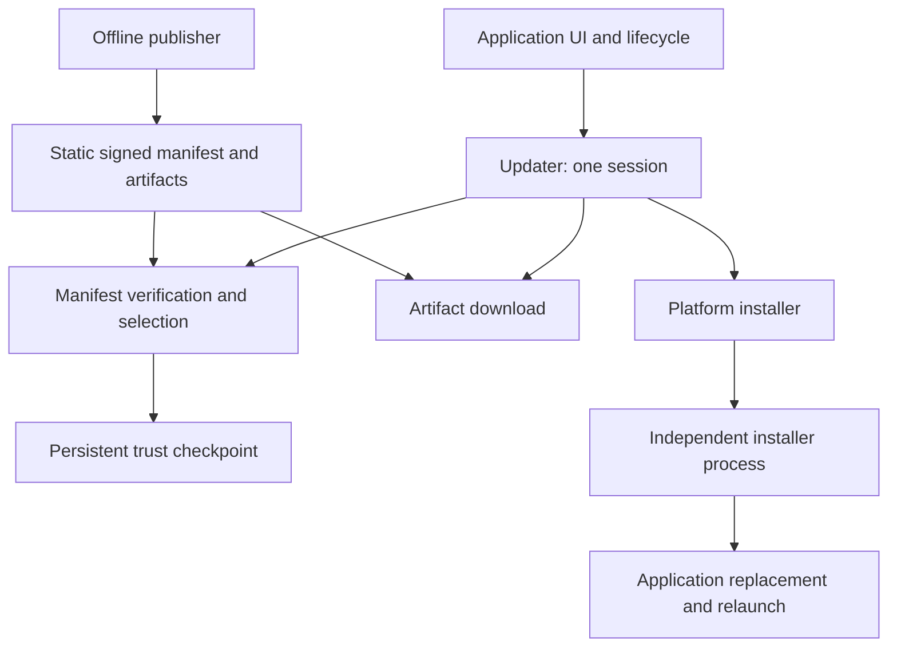
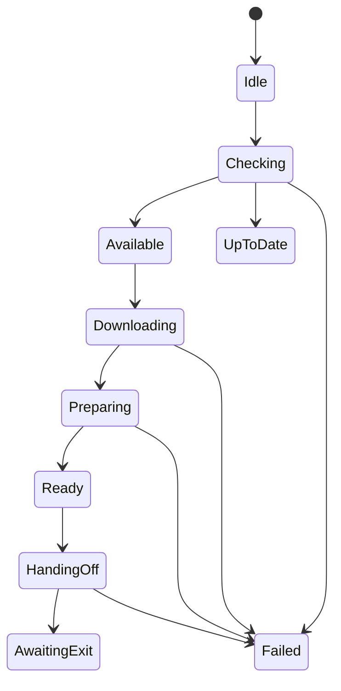

# Architecture

Design of the shared engine and platform adapters. See the [platform table](../README.md#platforms) and [acceptance results](verification.md) for current support.

## Purpose and boundaries

A standalone Kotlin Multiplatform SDK for applications distributed directly to desktop users. Applications own their interface, preferences and lifecycle. The SDK owns one update session and provides structured states and errors; it does not depend on Enjoy, Compose, a server product or a packaging plugin.

Three modules are sufficient initially:

| Module | Responsibility |
| --- | --- |
| `updater-core` | Signed manifest protocol, compatibility and release selection, monotonic checkpoints, update state machine, platform service contracts |
| `updater-jvm` | HTTPS transport, streaming downloads, JCA cryptography, persistent checkpoints and desktop installer adapters |
| `updater-publisher` | Offline key generation, artifact hashing and manifest signing; no upload credentials or deployment logic |

The core targets JVM and desktop Kotlin/Native. JVM networking and cryptography are available; the first installation adapter targets directly distributed macOS apps. Other platforms can add adapters for their distribution channels.

Dependencies point toward the core. Interfaces exist at effects and platform boundaries, not around every class. A separate Compose module can be added after real applications establish a reusable UI need.

## Sparkle mechanisms retained

The source study is pinned to [Sparkle 2.9.6, commit ac2def2](https://github.com/sparkle-project/Sparkle/tree/ac2def288cbff5cfc7df3ffef6abdf45b72bcb0a). This is an independent implementation; it does not embed Sparkle or implement its appcast wire format.

| Sparkle responsibility | SDK decision |
| --- | --- |
| Updater owns scheduling and one active update cycle | One state machine; overlapping commands are rejected rather than queued behind an installation |
| Basic, download and installer drivers divide the workflow | A small coordinator composes manifest, download and installation services |
| User driver separates interface from update execution | Observable state and explicit suspend commands; UI text and localization belong to the host |
| Appcast selection filters versions, channels and system requirements | An authenticated manifest binds application, channel, increasing release number and explicit artifact targets |
| Archive signature validation and application code-signing validation | Authenticate metadata and artifact bytes before extraction; validate platform identity before installation |
| Installer survives host termination | Prepare first, acknowledge handoff, request normal application exit, then replace and relaunch |
| Application replacement stages work on the destination volume | Stage beside the destination and retain the old installation through replacement |

Do not describe a successful process launch as a completed installation. A running client can know that an installer accepted a handoff. Completion must be recorded by the installer and observed after restart.

## Deliberate simplifications

First release: full artifacts, explicit download/install commands, a single channel per updater, an integer release order, static hosting, plain release notes and pinned signing keys. The core never compares a marketing version or OS package version to decide update order.

Deferred: binary deltas, XML compatibility, unattended installation, rollout cohorts, telemetry, HTML release notes, automatic privilege elevation and a general plugin registry. Download retries start a fresh temporary file; partial-byte resume can follow after cancellation and integrity behavior are stable.

Checking frequency belongs to a small policy invoked by the host's lifecycle or timer. A background check must not silently enable downloads or consent to installation. Manual checks can bypass frequency and skipped-release preferences, never signature or downgrade checks.

## Session and ownership

- Commands run in the caller's coroutine. Cancellation propagates and returns the session to a usable stable state; it is not reported as an update failure.
- One command owns mutable session state. A concurrent command receives a structured busy error without changing the active state.
- A selected release is an immutable snapshot of authenticated metadata. Callers cannot supply arbitrary files to the high-level install command.
- Downloaded files belong to the downloader until verification succeeds, then to the session. Failed or cancelled preparation releases its files. Prepared installations have explicit cleanup.
- A cleanup failure retains the resource reference. A new check or download is blocked until `discard()` succeeds, so an owned file cannot be silently replaced or abandoned.
- Installation preparation may be cancelled. After an independent installer acknowledges responsibility, the client must not delete its inputs or report cancellation as if nothing happened.
- A failed handoff must leave the current application runnable. Retrying an accepted handoff requires checking its persisted transaction, not starting another installer.
- Fatal runtime errors propagate; expected protocol, transport and installation failures have stable error codes and diagnostic causes.

## Trust model

Trust starts with public keys bundled in the installed application. HTTPS protects transport; signature verification authenticates publisher-controlled bytes even if artifact hosting is compromised. Artifact length and SHA-256 are inside the signed payload, so a second signature over the same artifact is unnecessary for this protocol.

The verifier checks the envelope's bounded size and encoding, verifies the exact payload bytes with a pinned Ed25519 key, and only then interprets payload fields. No reserialization or JSON canonicalization is required. Release notes shown to users are inside the authenticated payload.

Every successful manifest check atomically records its sequence, payload digest and observed time for the application/channel scope. Lower sequences and changed payloads at the same sequence are rejected. Expiration bounds replay of an old signed feed; a persisted time floor detects ordinary clock rollback. These guarantees depend on the device's clock and durable checkpoint, and cannot prevent server withholding before expiry, checkpoint deletion or compromise of the local user's account.

This is not a TUF implementation. It borrows explicit replay and expiry checks while omitting TUF's metadata roles, delegation and threshold root rotation. If those requirements arise, adopt a maintained TUF implementation rather than extend an informal imitation.

Key rotation uses overlapping pinned keys and multi-signed manifests: an update trusted by the old key distributes the new public key, later clients accept the new key, and the publisher retains old-key signatures while supporting older clients. A lost or compromised sole key cannot be recovered securely through the same trust channel. There is no fail-open timeout or unsigned fallback.

Local effect implementations are trusted SDK components. A hostile process with the same privileges as the application is outside the trust boundary. Elevated installation would add a new boundary and requires a separately reviewed authenticated IPC design.

## Installation contract

`prepare` consumes a verified artifact, validates its contents and creates an isolated staged installation. It must not overwrite the running application. `commit` revalidates staged input and hands ownership to an independent installer. The application exits only after acceptance; a user veto or exit timeout must keep the old app intact.

The helper is part of the application's signed distribution and runs independently of the files it replaces. It accepts a narrowly scoped request with a transaction identifier, expected application identity, expected release, fixed source/destination and the exact host process identity. Requests cannot carry arbitrary shell commands or select a privileged destination.

Required helper behavior:

1. Lock the destination and reconcile any prior transaction.
2. Validate source and destination identity, package policy, permissions and staging location; reject symlink redirection and unsupported layouts.
3. Revalidate staged content immediately before use, then acknowledge acceptance.
4. Wait for the exact host process to exit, with a deadline; never force-kill it.
5. Persist preparation state, replace using platform-supported safe operations and retain the old version until completion is recorded.
6. Atomic exchange failure leaves the original in place. After a completed exchange, preserve the new app and old backup even if a later journal write or relaunch fails; infer recovery status from validated bundle identity.
7. Relaunch through the platform and record the outcome. A launch request succeeding is not proof of application health.

Filesystem replacement recovery and post-launch application rollback are separate features. The latter needs a health handshake and data-schema migration policy; it is not promised in the first release.

macOS first targets a directly distributed, Developer ID signed, notarized `.app` in a user-writable location. Bundle ID, publisher identity and embedded release identity must match the manifest and installed app. A native helper avoids a dependency on the bundled JVM being replaced. Sandbox support, privilege elevation and arbitrary installer packages are deferred.

Windows must respect locked executables and installer product identity; MSI/EXE installation belongs to a format-specific adapter. Linux DEB/RPM installations belong to the package manager; a writable portable distribution can have a separate replacement adapter. An unsupported format returns a capability error rather than a successful no-op.

## Platform integration

The first release covers macOS/JVM apps distributed directly as DMGs. Windows and Linux have core targets and shared JVM services; their installers are future work. Android and iOS targets and adapters have not been added yet.

Mobile support would use the platform's update mechanism:

- **Android / Google Play:** [In-app updates](https://developer.android.com/guide/playcore/in-app-updates) provides flexible and immediate flows, with installation handled by Google Play. A simple integration can also [open the store listing](https://developer.android.com/distribute/marketing-tools/linking-to-google-play).
- **Android / direct distribution:** APK updates can use the system [PackageInstaller](https://developer.android.com/reference/android/content/pm/PackageInstaller) flow.
- **iOS / App Store:** show an update prompt and [open the app's store page](https://developer.apple.com/library/archive/qa/qa1629/_index.html); App Store manages the download and installation. [App Review Guidelines](https://developer.apple.com/app-store/review/guidelines/#software-requirements) describe the executable-code restrictions for store apps. Mac App Store apps also receive updates through their store.

A future mobile adapter can share update policy and presentation logic, while exposing the actions its store supports. Opening a store is a handoff; check the installed version on a later launch to determine completion. Keep that flow separate from the desktop artifact-staging contract.

## Release acceptance

Core: authenticated selection, tampered manifests, unknown keys, same-sequence mutation, expiry, clock rollback, downgrade, platform mismatch, cancellation and overlapping operations.

Runtime: bounded HTTP responses and artifact writes, redirect policy, timeouts, corrupt downloads, cleanup, atomic checkpoint updates and independent-process locking.

Installer: old-to-new fixture, cancelled exit, denied permissions, incorrect identity, modified staging files, failure at every replacement boundary, interrupted helper recovery and restart receipt. Signed and notarized real-app updates require separate acceptance on each supported OS; unit tests cannot substitute for those checks.
